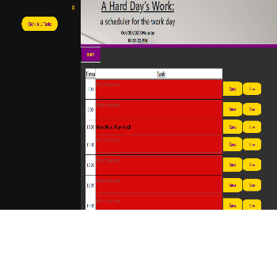
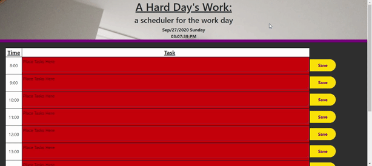

# Scheduler
live link: https://MrDawit.github.io/Scheduler \
## Purpose:
Time is the name of the game with this app. A work-day schedule that changes dynamically using javascript and jquery. This scheduler has the ability to save your tasks by hour and let you know which tasks haven't met their deadline (there is still time!). 

## Created By:
Shalom Dawit\
LinkedIn:https://www.linkedin.com/in/shalom-dawit-a0a5a4126 \
GitHub:https://github.com/MrDawit \
Email:Shalom.Dawit@gmail.com \

## Technologies Used:
* Javascript
* Jquery library
* Moment library
* HTML DOM
* localStorage API
* HTML
* CSS

## Files Included:
* script.js
* moment.js
* index.html
* style.css
* readme.md

## Notes:
* issues with scope and i value were fixed
* sidenav gives flexibility to add more functionality
* want to add a scheduler name that stays after refresh (gets stored in localstorage) but can be changed when wanted(clear button)

